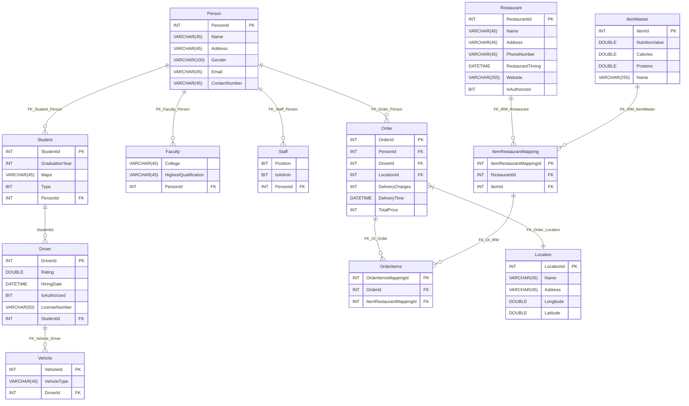

# FoodDeliveryManager
NKU2025数据库系统大作业

## 实体关系设想

1. **用户实体**（Person）与**订单实体**（Order）：一对多关系
   （一个用户可创建多个订单，一个订单仅属于一个用户）
2. **地址实体**（Location）与**订单实体**（Order）：一对多关系
   （一个地址可关联多个订单，一个订单仅对应一个地址）
3. **订单实体**（Order）与**订单项实体**（Order-items）：一对多关系
   （一个订单可包含多个订单项，一个订单项仅属于一个订单）
4. **订单项实体**（Order-items）与**餐厅菜品映射实体**（ItemRestaurantMapping）：多对多关系
   （一个订单项可关联多个餐厅的菜品组合，一个菜品组合可被多个订单项引用）
5. **订单实体**（Order）与**司机实体**（Driver）：多对一关系
   （多个订单可由同一司机配送，一个订单仅分配给一个司机）
6. **餐厅实体**（Restaurant）与**餐厅菜品映射实体**（ItemRestaurantMapping）：多对多关系
   （一个餐厅提供多种菜品，一种菜品可被多个餐厅供应）
7. **司机实体**（Driver）与**车辆实体**（Vehicle）：一对多关系
   （一个司机可驾驶多辆车辆，一辆车辆仅分配给一个司机）
8. **餐厅菜品映射实体**（ItemRestaurantMapping）与**菜品主数据实体**（ItemMaster）：多对多关系
   （一个菜品映射对应一个基础菜品，一个基础菜品可出现在多个餐厅的映射中）

## ER图

## 实现内容

1. **用户注册**（限制使用真实姓名、真实邮箱、真实学号）
2. **用户登录**（仅限user表中存在的信息）
3. 整合12张表为4组表格进行展示，分别是用户、订单、司机、餐厅（展示化规范）
4. 实现了用户信息的**删除**（级联，包括订单、司机、餐厅等一系列的影响）
5. 实现了**订单的插入**（订单细节自动创建、司机/餐厅订单量相应增加）
6. 实现了**订单详情的查看**（配送员，餐厅地址，食品名称，用户，食品的营养值、蛋白质含量、热量、数量，费用，时间）
7. 实现了**司机内容的更新**（人员信息、订单信息相应更新）
8. 实现了**餐厅视图的查询**，查询方式包括：
   1. 餐厅名称
   2. 菜品名称
   3. 订单量
   4. 授权状态

9. 可视化的**数据分析**

10. dashboard便捷**跳转**

## 实体关系模式（E/R Approach 格式）

#### **1. Person**

Person ( <u>PersonId</u>, Name, Address, Gender, Email, ContactNumber )

- **主键**：`PersonId`

#### **2. Order**

Order ( <u>OrderId</u>, PersonId (参照 Person.PersonId), DriverId (参照 Driver.DriverId), LocationId (参照 Location.LocationId), Delivery_Charges, Delivery_Time, Total_Price )

- **主键**：`OrderId`
- **外键**：`PersonId`, `DriverId`, `LocationId`

#### **3. Location**

Location ( <u>LocationId</u>, Name, Address, Longitude, Latitude )

- **主键**：`LocationId`

#### **4. OrderItems**

OrderItems ( <u>OrderItemMappingId</u>, OrderId (参照 Order.OrderId), ItemRestaurantMappingId (参照 ItemRestaurantMapping.ItemRestaurantMappingId) )

- **主键**：`OrderItemMappingId`
- **外键**：`OrderId`, `ItemRestaurantMappingId`

#### **5. ItemRestaurantMapping**

ItemRestaurantMapping ( <u>ItemRestaurantMappingId</u>, RestaurantId (参照 Restaurant.RestaurantId), ItemId (参照 ItemMaster.ItemId) )

- **主键**：`ItemRestaurantMappingId`
- **外键**：`RestaurantId`, `ItemId`

#### **6. ItemMaster**

ItemMaster ( <u>ItemId</u>, NutritionalValue, Name, Calories, Proteins )

- **主键**：`ItemId`

#### **7. Restaurant**

Restaurant ( <u>RestaurantId</u>, Name, Address, PhoneNumber, RestaurantTiming, Website, IsAuthorized )

- **主键**：`RestaurantId`

#### **8. Vehicle**

Vehicle ( <u>VehicleId</u>, DriverId (参照 Driver.DriverId), VehicleType )

- **主键**：`VehicleId`
- **外键**：`DriverId`

#### **9. Driver**

Driver ( <u>DriverId</u>, Rating, HiringDate, IsAuthorized, LicenseNumber )

- **主键**：`DriverId`

#### **10. Student**

Student ( <u>PersonId</u> (参照 Person.PersonId), GraduationYear, Major, Type )

- **主键**：`PersonId`
- **继承关系**：`Person` 的子类

#### **11. Staff**

Staff ( <u>PersonId</u> (参照 Person.PersonId), Position, IsAdmin )

- **主键**：`PersonId`
- **继承关系**：`Person` 的子类

#### **12. Faculty**

Faculty ( <u>PersonId</u> (参照 Person.PersonId), College, HighestQualification )

- **主键**：`PersonId`
- **继承关系**：`Person` 的子类

## 使用方式

克隆仓库

运行所有的sql文件，先运行以`FoodDeliverySystem`开头的文件，再运行剩下几个

最后运行`app.py`
